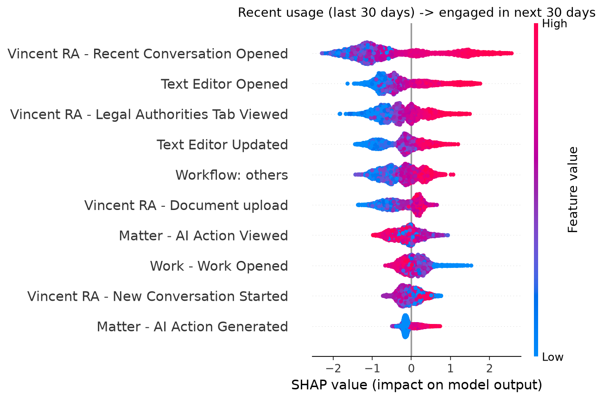
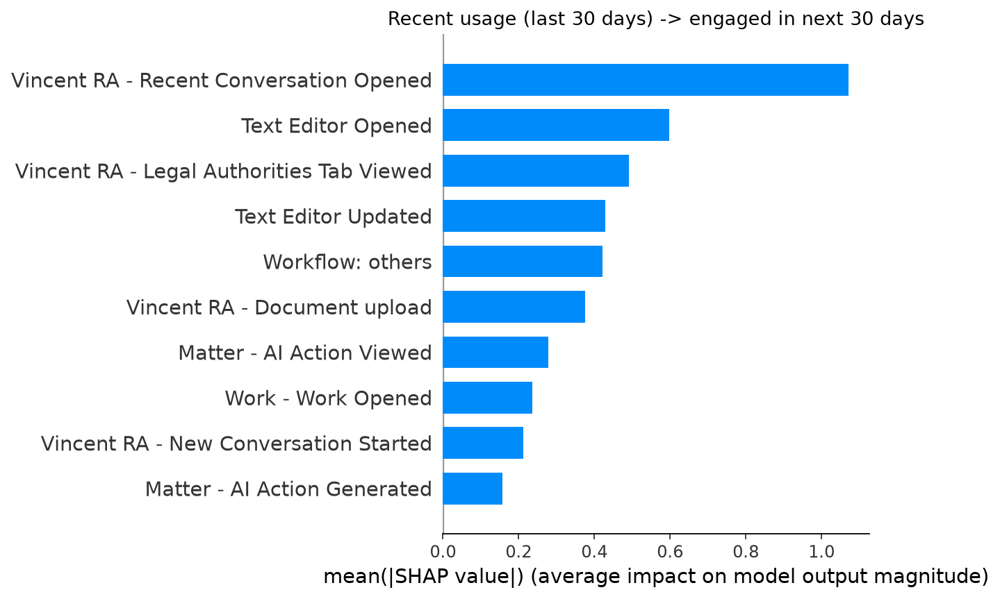

# Top 10 Actions Predicting User Engagement

## Objective

**Question:** Which recent 30-day behaviors most strongly predict that a
user will be engaged in the next 30 days?

**Input:** Each user's own most recent 30 days of behavior (a per-user
trailing usage window).

**Label:** Whether the user becomes engaged in the following 30 days,
defined as reaching at least 7 distinct Power User or Elite Power User
days. The feature window and the outcome window are non-overlapping.

**Model:** XGBoost, trained under stratified 5-fold cross-validation.

**Output:** SHAP values, used to rank the top 10 behaviors by predictive
strength and direction.

## Population and Model

| Metric | Value |
|---|---:|
| Modeled users | 5,415 |
| Engaged within the following 30 days | 1,139 (21.0%) |
| Out-of-fold ROC-AUC | 0.942 |
| Out-of-fold PR-AUC | 0.851 |
| Label-permutation control | 0.499 (no evidence of leakage) |

## Top 10 Predictive Features

| Rank | Feature | Mean Absolute SHAP Value | Direction |
|---:|---|---:|:---:|
| 1 | Vincent RA – Recent Conversation Opened | 1.072 | Positive |
| 2 | Text Editor Opened | 0.597 | Positive |
| 3 | Vincent RA – Legal Authorities Tab Viewed | 0.492 | Positive |
| 4 | Text Editor Updated | 0.430 | Positive |
| 5 | Workflow: Others | 0.421 | Positive |
| 6 | Vincent RA – Document Upload | 0.376 | Positive |
| 7 | Matter – AI Action Viewed | 0.278 | Negative |
| 8 | Work – Work Opened | 0.235 | Negative |
| 9 | Vincent RA – New Conversation Started | 0.213 | Positive |
| 10 | Matter – AI Action Generated | 0.157 | Positive |





## Findings

1. **Returning to an existing conversation is approximately five times more
   predictive than initiating a new one** (1.072 vs. 0.213). Sustained,
   habitual use is a stronger signal than initial trial.
2. **Legal Pad drafting activity is a top-tier signal.** Text Editor Opened
   (0.597) and Text Editor Updated (0.430) together approach the top
   feature's weight, indicating active production work drives engagement.
3. **The "Workflow: Others" category is highly predictive but
   unattributed.** It ranks 5th (0.421), while every individually named
   workflow type ranks 23rd–44th. Further investigation of this category's
   composition is recommended before treating it as actionable.
4. **Passive interactions are negative predictors.** Work – Work Opened
   (0.235, negative direction) and Matter – AI Action Viewed (0.278,
   negative direction) are both low-effort, non-deliberate actions. Their
   negative direction, contrasted with the positive direction of the
   specific, effortful actions above, indicates that depth of deliberate
   usage predicts engagement — breadth of passive browsing does not.

## Reproducibility

```bash
cd top_actions
python pull_data.py
python power_user_temporal_analysis.py
```
Full ranking: `sub_feature_importance.csv`. Per-user SHAP values: `per_user_shap.csv`.
